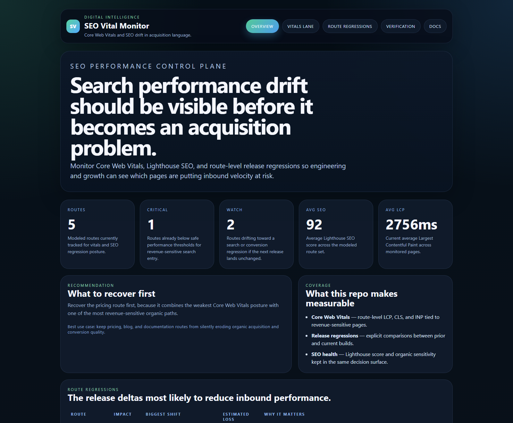
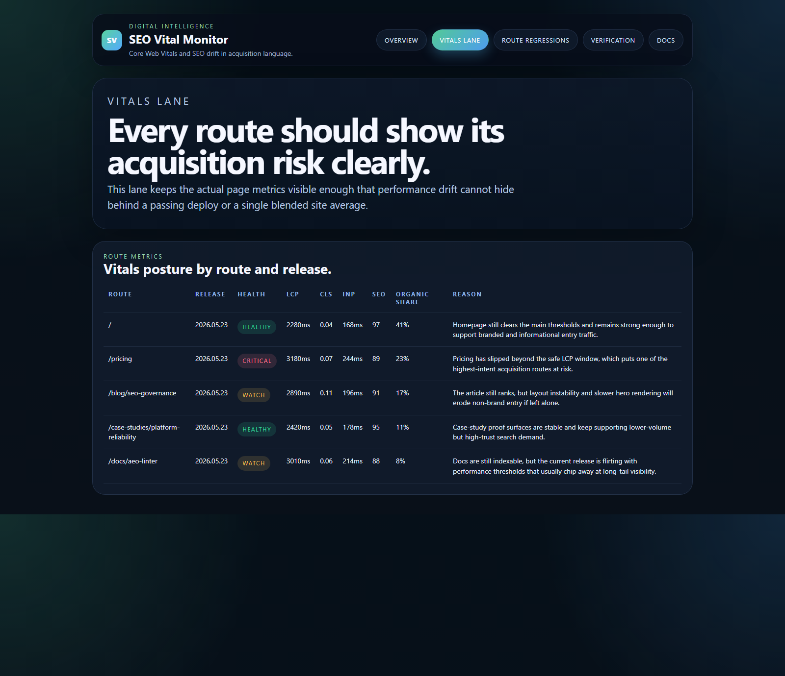
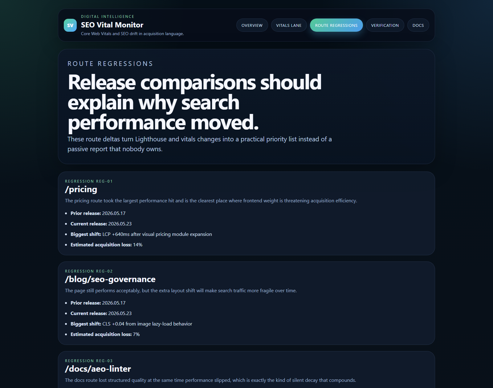
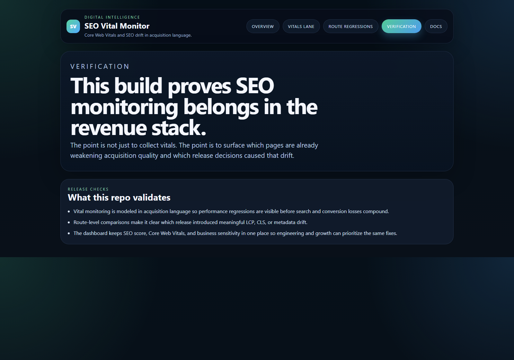

# SEO Vital Monitor

TypeScript control plane for Core Web Vitals, Lighthouse regressions, and route-level SEO performance drift.

## Why this exists

SEO performance decay is often treated like a slow analytics problem after the damage is already visible. By then:
- pricing and conversion routes are already slower than they should be
- route-level regressions get buried inside one blended site average
- metadata and vitals drift compound across releases
- organic acquisition weakens before growth teams know which deploy caused it

`seo-vital-monitor` turns route-level performance drift into an acquisition-readable control plane before Core Web Vitals degradation becomes a search and conversion problem.

## Routes

- `/`
- `/vitals-lane`
- `/route-regressions`
- `/verification`
- `/docs`

## API

- `/api/dashboard/summary`
- `/api/vitals-lane`
- `/api/route-regressions`
- `/api/verification`
- `/api/sample`

## Screenshots






## Local Development

```powershell
cd seo-vital-monitor
npm install
npm run dev
```

Open:
- [http://127.0.0.1:5372/](http://127.0.0.1:5372/)
- [http://127.0.0.1:5372/vitals-lane](http://127.0.0.1:5372/vitals-lane)
- [http://127.0.0.1:5372/route-regressions](http://127.0.0.1:5372/route-regressions)
- [http://127.0.0.1:5372/verification](http://127.0.0.1:5372/verification)
- [http://127.0.0.1:5372/docs](http://127.0.0.1:5372/docs)

## Validation

- `npm run build`
- `npm run test`
- `npm run demo`
- `npm run smoke`
- `npm run render:assets`

## Docs

- [Architecture](./docs/architecture.md)
- [Origin](./docs/ORIGIN.md)
- [Changelog](./CHANGELOG.md)
